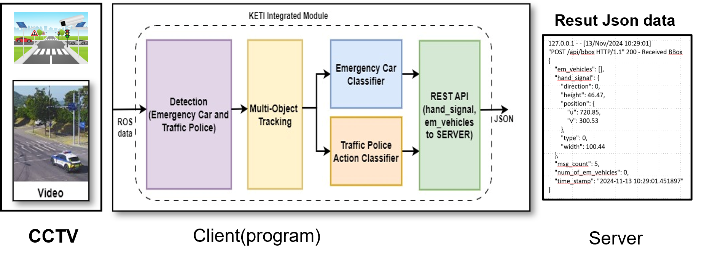
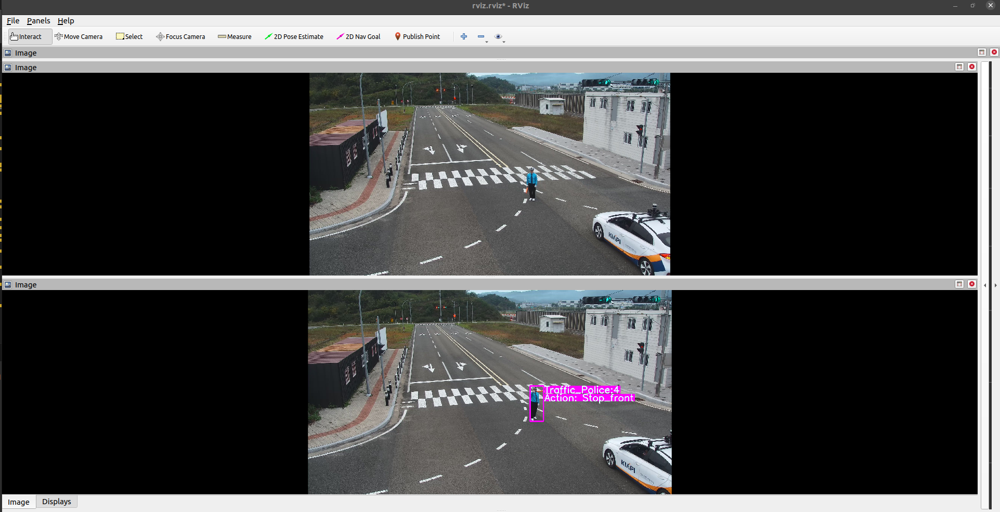
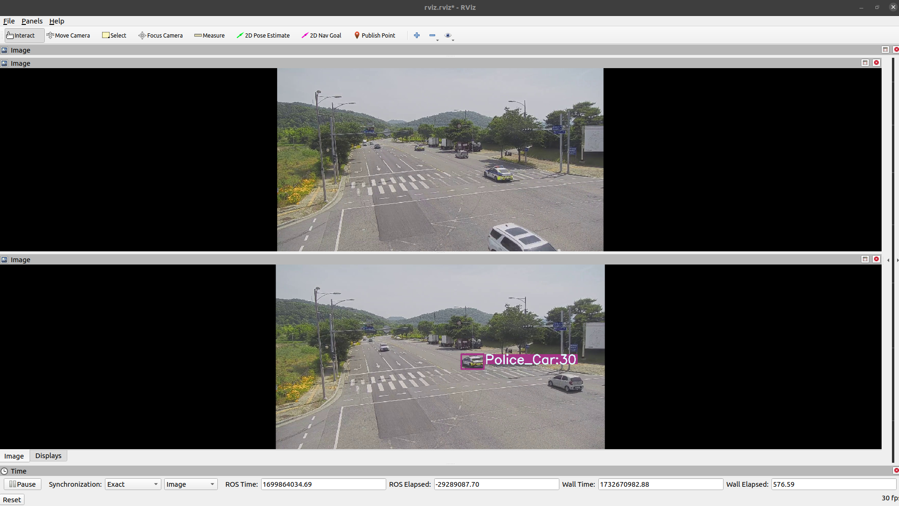

# Emergency Traffic Detection System
A computer vision system that detects and recognizes emergency traffic situations, including:
- Traffic police actions (14 different types)
- Emergency vehicles (4 categories)



## Installation

### Prerequisites
- Ubuntu 20.04
- ROS Noetic
- Python 3.x

### Quick Start
```bash
git clone https://github.com/Ganzooo/yolov10_track_ros_gesture
cd yolov10_track_ros_gesture
pip install -r requirements.txt
```
### ROS Setup
- Install ROS Noetic following the official ROS installation guide [ROS official web](https://wiki.ros.org/ROS/Installation). (I recommend use this guide to install [ROS two line install](https://wiki.ros.org/ROS/Installation/TwoLineInstall/)). Ensure rospy for Python 3 is installed.

## Dataset & Model Weights

### Download Test Dataset
- Traffic Police sample test rosbag from Drive [TP sample](https://drive.google.com/file/d/1imHvkTY3uN72iJhLsP1Wdt_SdxbIko_l/view?usp=sharing)
- Emergency car sample test rosbag from Drive [EC sample](https://drive.google.com/file/d/1JMRbaSAejG0KQSMHGu2Tzo5fO5F5J_ls/view?usp=sharing)

### Model Weights
- Model weights can be downloaded from Drive [Weights](https://drive.google.com/drive/folders/1a0vmGHkCsteNcjFFkDXNO5sfEDNtLlOC?usp=drive_link). 
- Place weight files in ./data/weight/ directory.

## Running the System 

### Launch ROS Core
```
roscore
```

### Play Test Data
```
cd /rosbag_path/
rosbag play -i name_of_rosbag.bag
```
### Launch Visualization
```
rviz
```

### Run Detection System

```
python ./united_trafficpolice_emergency_case_datection.py
```

### Server API test 
For proper server test you need to change server IP address at united_trafficpolice_emergency_case_datection.py file.
```
python ./server_side_flask_api.py.py
```

## Results
RVIZ test result.
Traffic plolice action recognition result(Top: Input rosbag, Bottom: Detected and Recognized rosbag)


Emergency car detection result(Top: Input rosbag, Bottom: Detected and Classified rosbag)


